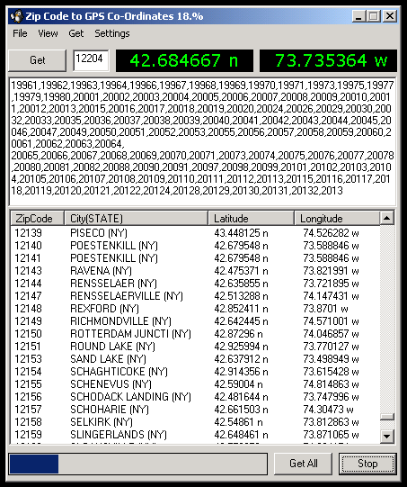



## Zip\-code to LATT/LONG

### Description

Grabs your LATT/LONG by zip-code from the US Census zip database.
 
### More Info
 
Zipcode list (INCLUDED)

LATT/LONG for your zipcode

Wait a long time on slow connections

             |
---                |---
**Submitted On**   |2003-08-29 12:33:34
**By**             |[cr8zy1van](https://github.com/Planet-Source-Code/PSCIndex/blob/master/ByAuthor/cr8zy1van.md)
**Level**          |Intermediate
**User Rating**    |5.0 (15 globes from 3 users)
**Compatibility**  |VB 6\.0
**Category**       |[Complete Applications](https://github.com/Planet-Source-Code/PSCIndex/blob/master/ByCategory/complete-applications__1-27.md)
**World**          |[Visual Basic](https://github.com/Planet-Source-Code/PSCIndex/blob/master/ByWorld/visual-basic.md)
**Archive File**   |[Zip\-code\_t1637318292003\.zip](https://github.com/Planet-Source-Code/cr8zy1van-zip-code-to-latt-long__1-48078/archive/master.zip)

